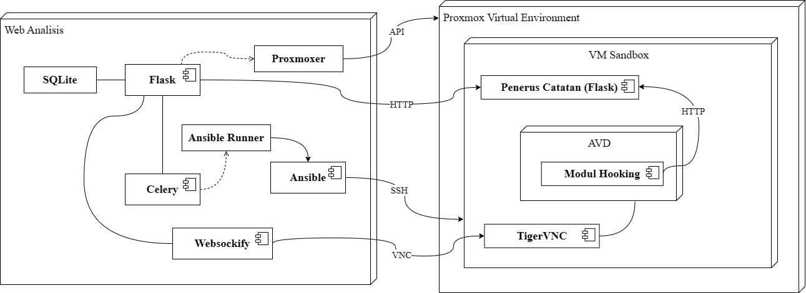

# AVD-based Android Sandbox Website for Dynamic Analysis

This project is created as part of ITS undergraduate thesis task. We attempt to implement an AVD-based, web based Android sandbox, that can be used for Android dynamic analysis. Here is the architecture designed for the programs.

The web side of things is built with Flask, that connects to Proxmox Virtual Environment (PVE) via it's API. Celery handles background task, while Websockify handles NoVNC request for control on AVD's screen.

The web needs to be deployed on a machine that is capable to connect to the designated PVE server and it's network, where all the VM connect to. This means that the web can be deployed inside the PVE as a VM, but also can be deployed somewhere else as long as it can connect to the PVE and it's network (like via VPN, tunneling, choose the preferred method based on needs).

The AVD side of things have a hooking module built with LSPosed_mod. This establishes a way to observe and log Android application's behavior via called Android API's. Because AVD's network might be down or web might not be reachable publicly, the log is not sent directly to the web. Instead, it's sent to a locally deployed Flask program that will queue the log in memory, via `adb reverse`. Web will communicate and get the log from that queue program.

Subsequent explanation for each component can be read on it's respective README.